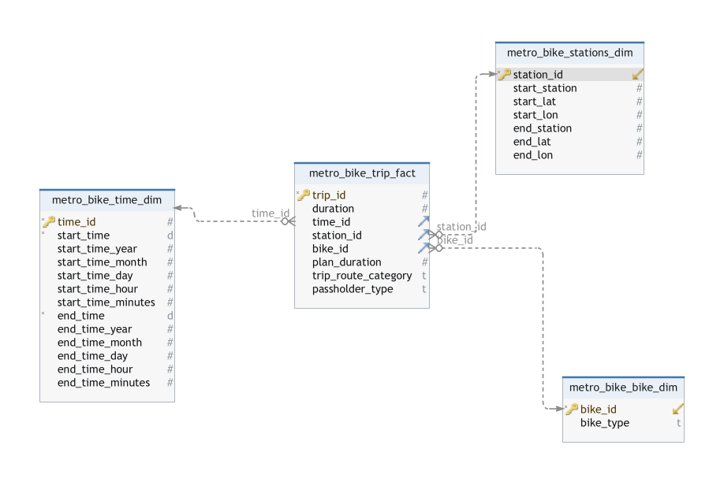
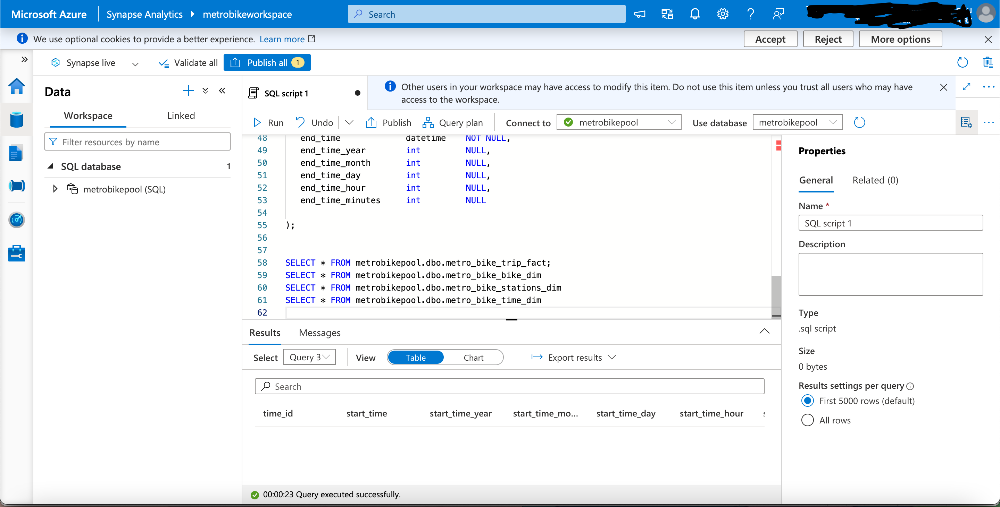
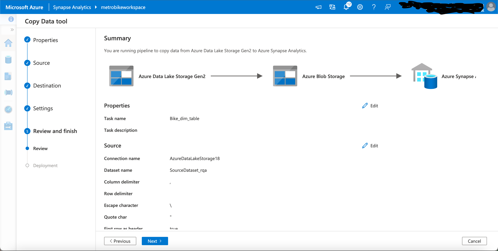
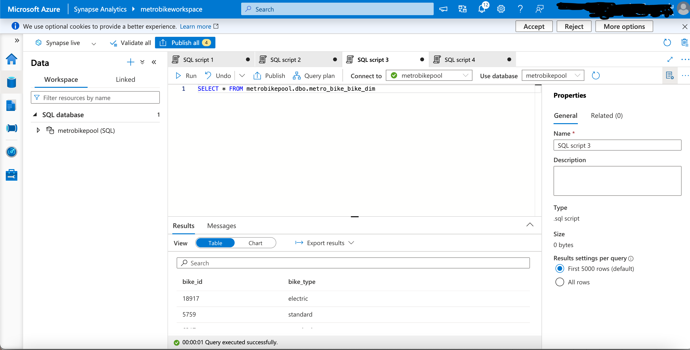

# Metro_Bike_Project
# Metro Bike Share Trip Analysis

## Introduction
This project is about constructing a data pipeline and establishing data architecture. This project will display data sourcing to visualization, integrating key components of data collection, storage, transformation, and presentation. For this project, both tech skills for handling data and for organizing it well (data architecture) and making it look good (data visualization) are needed. My main goal is to create an efficient data pipeline so to showcase this I've chosen to explore and work with Metro Bike Share Data for this project. 

## Commpany's Background
Metro Bike Share is a public bicycle-sharing system operated by Metro, in collaboration with partners like Bicycle Transit Systems. Designed to provide convenient and sustainable transportation options, Metro Bike Share allows users to rent bicycles for short trips in urban areas. The system aims to enhance mobility, reduce traffic congestion, and promote a healthier and more eco-friendly mode of transportation. With bike stations strategically located throughout cities, Metro Bike Share offers an accessible and efficient means of commuting, contributing to the overall accessibility and sustainability of urban transportation systems.

## Hierarchy

## Data Sourcing
Source: [Link to Metro Bike Share Data](https://bikeshare.metro.net/about/data/)
Data Dictinoary: [Data_Dictionary_Metro_Bike.xlsx](Data_Dictionary_Metro_Bike.xlsx)
Tools: Google Colab and Python
After getting fimilair with the data, I then procced to scarpe the website using these python code in Google Colab: [Extraction_Metro_Bike.ipynb](path/to/Extraction_Metro_Bike.ipynb)

Once the links were successfully downloaded from the source, I noticed the links were zip file, which meant they were compressed files, therefore I used the following codes to unzip the files: [Unzip_Metro_Bike.ipynb](path/to/Unzip_Metro_Bike.ipynb)

## Storage
Data Store: Azure, often referred to as Microsoft Azure, is a cloud computing platform and service provided by Microsoft. 
This is the python script I used to upload the unzip files into Azure containers: [Staging_Area_Metro_Bike.ipynb](Staging_Area_Metro_Bike.ipynb)

## Modeling
Fact Table and Dimension Table :

## Data Warehouse
Using the Azure Synapse, I created a Synapse workspace that will conatined a storage container and SQL pool. The storage container will hold the cleaned data after it's transformed and the SQL pool which allows me to allocate and manage resources for querying large datasets. 

## ETL
First, I extracted the data from the Azure container that store the data. 
Then performed these transformations:
1. Checked for duplicated rows
2. Replaced missing null values
3. Converted data types
4. Lowercased the data
5. Implement Datetime format
6. Generated unique IDs for station_id and time_id
Here is the python codes used: [ETL.ipynb](ETL.ipynb)

Once the transformations were done, I saved the cleaned data into a csv file which gets loaded into the storage container in the Synapse workspace using the code:[Loading_into_storage_container_datawarehouse.ipynb](Loading_into_storage_container_datawarehouse.ipynb)

## Modeling
1. In Azure Synapse Analytics, I need to create empty tables in my SQL pool which were done using the SQL Script:[Your SQL Script](your_script.sql)
   Here is how the empty tables looked after running the code:
2. Now, I have the empty tables created, I procceed to ingest the data performing a one-time load into the pipeline, from our Azure Data Lake Storage into our Synapse Data Warehouse.
 After the pipelines were successful I still needed to load the data into the empty table that were previously cretated and to do this I used the SQL Code seen in the image, which is done separately for each table. After the table are load, I can now create visualize the data. 

## Serving
Tableau Dashboard:[Link to Metro Bike Share Dashboard](https://public.tableau.com/views/Metro_Bike_Share_Insights/Metro_Bike_Dashboard?:language=en-US&publish=yes&:display_count=n&:origin=viz_share_link)

